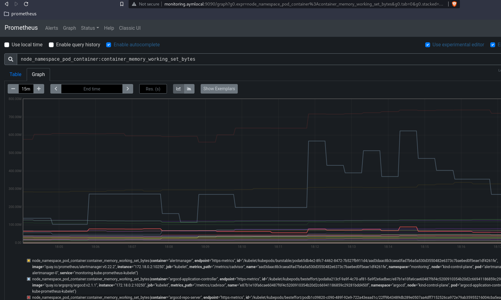

# K8s Prometheus Helm chart via ArgoCD - Manual Installation

This is a quick manual deployment of ArgoCD on a local Kubernetes cluster to install Prometheus through the App of Apps pattern via its Helm chart.

 ## Prerequisites

It is assumed that the following binaries are already installed on the machine:
- kubectl
- docker
- kind kubernetes cluster

## Create the local cluster 

The K8s cluster was created using the following [configuration file](kind-cl.yaml). The command to start same is as follows:

```
$ kind create cluster --config=kind-cl.yaml
```

#### Add ingress to the cluster
Ingress to the cluster is through the Kubertenes version of the NGINX reverse proxy Ingress controller.

```
$ kubectl apply -f ingress-nginx.yaml
```
And verify that the Ingress controller is ready:
```
$ kubectl get all -n ingress-nginx 
```
    
### Set up a cert-manager
Install the Kubernetes certificate management controller _(cert-manager)_ in the cluster to generate and manage the TLS certificates that are required for internal communication. 

```
$ kubectl apply --validate=false -f cert-manager.yaml
```
After that the Cert-manager pods are ready, create the issuer:
```
$ kubectl apply -f cert-issuer.yaml
```

## Install ArgoCD 
Argo CD is a declarative, GitOps continuous delivery tool for Kubernetes. It automates the deployment of the desired application states in the specified target environments.

```
$ kubectl create namespace argocd 
$ kubectl apply -n argocd -f https://raw.githubusercontent.com/argoproj/argo-cd/stable/manifests/install.yaml
```
#### Add host to hosts file
The matching entry as defined in the Ingress configuration has been added to the hosts file so that it can be resolved to the localhost.
```
$ echo "127.0.0.1 localhost   argocd.aymlocal" >> /etc/hosts
```
#### Apply ingress
``` 
$ kubectl apply -f ingress.yaml
```

## Access ArgoCD

Access to the ArgoCD UI is through a web browser. For ease and security of access, the above Ingress controller has been deployed as per above to connect to the service along with the cert-manager to make use of HTTPS. 

> https://argocd.aymlocal

The credentials to use are:

> Username: `admin`

And the password is obtained by quering the secret from the install:

```
 $ kubectl -n argocd get secret argocd-initial-admin-secret -o jsonpath="{.data.password}" | base64 -d
```

## Deploy and Access Prometheus

The last step is to deploy Prometheus from within ArgoCD using it's official Git repository. The deployment is through the creation of an App from the UI.

The Prometheus Git repo to use in the below is:
`https://github.com/prometheus-community/helm-charts`

From the ArgoCD UI, create a `NEW APP`, fill in the proper details for the source Helm chart, `kube-prometheus-stack  last-version`, then `Create` and `SYNC`.

Following successful deployment, the App details should look like this on the ArgoCD UI:

> 

Access to the Prometheus interface should now be possible. An example of the queries and graphs of the K8s resources can be seen below:

> 


## References and Documentation

The following online resources have been helpful in understanding and creating the above mini guideline:

- [Cluster Bootstrapping - App of Apps Pattern](https://argoproj.github.io/argo-cd/operator-manual/cluster-bootstrapping/)
- [Prometheus Official Helm Chart](https://prometheus-community.github.io/helm-charts/)
- [NGINX Ingress Controller](https://github.com/kubernetes/ingress-nginx)
- [Installing a cert-manager](https://www.ibm.com/docs/en/app-connect/containers_cd?topic=kubernetes-installing-cert-manager-in-your-cluster)